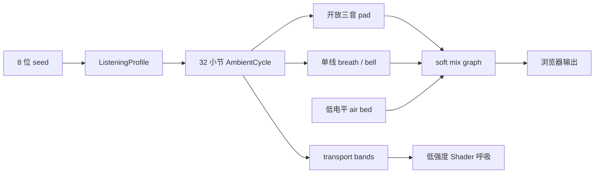

# NAGI 放松音乐架构

## 1. 为什么重做

旧系统把“生成能力强”误当成“好听”：它要求覆盖十二种调式、二十种拟真乐器、多声部对位、铜管与定音鼓、高潮 tutti、重拍不协和及持续的织体变化。测试可以全部通过，但这些指标共同提高了事件密度、频谱复杂度和注意力负担。

新的目标不是展示作曲算法，而是让人愿意把页面长时间留在身边。系统因此采用减法设计：随机性只负责在安全边界内选择世界、调性和乐句微变化，不再决定每个局部细节是否突然发生。

## 2. 研究转译

NAGI 不把任何单一论文当成“悦耳公式”，而是把重复出现的证据转成保守边界：

- Bernardi 等人的生理实验发现，速度是唤醒反应的重要因素，慢速或冥想音乐更容易产生放松效果，而停顿的效果尤其明显。因此速度被限定在 `54–63 BPM`，每个八小节乐句保留一整小节不产生新材料。[PubMed](https://pubmed.ncbi.nlm.nih.gov/16199412/)
- Staum 与 Brotons 的实验中，参与者整体明显偏好较低音量的放松音乐。因此 master 默认电平、单音增益和压缩比都保持克制。[PubMed](https://pubmed.ncbi.nlm.nih.gov/10806471/)
- Lahdelma 与 Eerola 的实验显示，roughness 与 pleasantness、harmoniousness 和 preference 呈负相关；熟悉度也有独立影响。因此系统使用熟悉的开放和声，禁止持续半音碰撞，并直接审计和弦 roughness。[PMC](https://pmc.ncbi.nlm.nih.gov/articles/PMC7250829/)
- 放松感同时受 tempo、mode、和声/节奏/旋律复杂度、音色、音域与动态变化影响，而且个人偏好非常重要。因此系统提供四个性格不同但都低唤醒的聆听世界，而不是只输出一条所谓“科学最佳”的音乐。[PubMed](https://pubmed.ncbi.nlm.nih.gov/26753216/)
- 音频特征研究常把 spectral centroid、sharpness、harmonicity、energy、loudness 和 spectral flux 作为与焦虑或情绪相关的描述量。NAGI 因而同时限制高次谐波、低通范围、增益和事件变化率。[PMC](https://pmc.ncbi.nlm.nih.gov/articles/PMC8775969/)

这些约束只能提高“更可能适合放松”的概率，不能代替真实听者偏好。seed 可复现正是为了让喜欢的状态可以被保留和分享。

## 3. 数据流



`ambient-score.ts` 是纯函数层；给定 seed 与 cycle index，输出完全确定的 `AmbientCycle`。`audio-engine.ts` 只负责把已规划事件按时间送入 Web Audio 图，不在 scheduler 内临时“灵感式”抽签。

## 4. 乐谱模型

### 四个聆听世界

| world | 显示状态 | 速度范围 | 主要材料 |
| --- | --- | ---: | --- |
| `lagoon` | still water | 57–61 | 大调五声音阶、sus 与开放主和弦 |
| `hearth` | warm light | 59–63 | 大调五声音阶、关系小和弦与 IV |
| `cloud` | open sky | 55–59 | Dorian 五声音阶、开放小三和弦与 sus4 |
| `memory` | evening memory | 54–58 | 较慢的大调五声音阶、关系小和弦与回归 |

所有世界共享以下硬约束：

- 每个和弦正好三个音；最低两个声部至少相隔七个半音。
- 同一和弦的 psychoacoustic roughness proxy 不超过 `0.065`。
- 相邻和弦交接不存在半音碰撞；pad 会先呼出，再让新和弦呼入。
- 每个周期 32 小节，由 `A / A′ / B / A″` 四个八小节乐句组成。
- 每个乐句只有六个旋律事件；第 29–32 拍不产生任何新和声或旋律。
- 旋律限定在五声音阶窄音域，最大跳进七个半音；强拍必须是当前和弦音。
- `bell` 与 `breath` 的完整包络不会互相叠加，避免单线旋律变成意外复调。

### 为什么不再自动换情绪

系统可以无限循环，但不会自行从 calm 漂移到 tense 或 dark。长时间一致性比“覆盖所有情绪”更适合放松场景。只有用户主动选择 `new tide` 才会换 seed；旧世界先降至近静音，新世界再缓慢出现。

## 5. 声音设计

系统不再伪装成真实钢琴、长笛或弦乐队。低成本物理模型在缺少真实采样细节时容易产生塑料感、循环接缝和不自然的高频；明确承认“这是柔和合成器”反而更连贯。

三个音色全部只使用递减的整数谐波：

- `pad`：四个低幅谐波，约 3.8 秒 attack；每个和弦只开三个 oscillator。
- `breath`：三个谐波、低深度 detune 曲线和 1.1 秒 release；没有额外噪声爆发。
- `bell`：三个谐波、短 attack、2.5 秒尾音；不使用非整数 partial 制造金属 beating。

公共图为：

```text
voices / air
  ├─ dry bus ───────────────┐
  └─ convolver → wet LPF ───┤
                             ↓
scene fade → presence LPF → rumble HPF → gentle compressor → master → analyser
```

混响使用本地生成的双声道衰减 impulse，不请求网络资源。`DynamicsCompressorNode` 只做软保护，参数遵循 Web Audio 标准定义；它不是用来把安静音乐推响。[Web Audio API](https://webaudio.github.io/web-audio-api/)

## 6. 交互与视觉

指针移动曾会触发可听音符，快速滑动因此能破坏当前和声。现在交互只平滑改变：

- master presence low-pass 的截止频率；
- air bed 的极小幅度；
- Shader 中已有的 pointer energy。

视觉仍读取 `beatPhase`、`barPhase`、`phrase` 与轻微 `pulse`，但 transport 强度被压低；前景不会随每拍闪烁。seed 视觉只会选择 `CALM / WARM / DREAMY / NOSTALGIC` 四类低唤醒状态。

## 7. 验收模型

`scripts/music-audit.mjs` 不再测试“乐器够不够多”，而是测试系统是否持续守住边界。当前自动审计：

- 遍历 4,096 个 seed 与 16,384 个完整 cycle；
- 合计模拟约 600 小时；
- tempo `54–63 BPM`；
- 最大和弦 roughness `0.06255`；
- 最低声部间距 `7` 个半音；
- 最大旋律跳进 `7` 个半音；
- 最大旋律密度约 `0.197 events/s`；
- 每个乐句休止占比 `12.5%`；
- melodic source 同时数始终为 `1`；
- visual density 与 motion 同样有低上限；
- 同一 seed 与 cycle 必须深度相等。

运行：

```bash
npm run test:music
```

自动审计不能证明每个人都会喜欢，但它可以阻止旧问题复发：密集声部、突然高唤醒状态、半音堆叠、无限尾音、过亮频谱和没有呼吸的连续填充。
